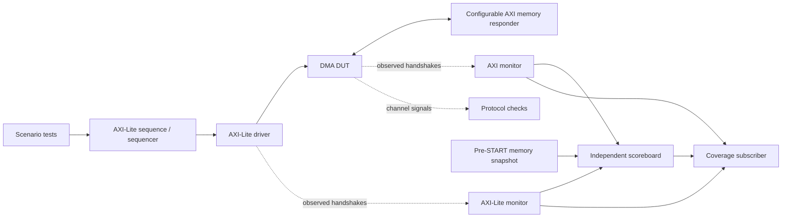

# AXI DMA verification portfolio

I built this project to verify a small memory-to-memory DMA and show how I approach
design verification: define the contract, build independent checks, reproduce
defects, and keep evidence that another engineer can inspect and rerun. The DUT
uses **32-bit, aligned, single-beat AXI INCR** transactions and AXI-Lite control
registers. My main testbench uses SystemVerilog and UVM 1.2.

I have run **39/39 passing UVM cases**, hit **70/70 selected requirement bins**,
and checked **14/14 expected unit/checker outcomes**. I also ran an independent
Verilator testbench: **60/60 full-DUT cases passed** with concurrent SVA and native
code coverage enabled. Quartus Analysis & Synthesis completed with zero errors.
The [local measurements](docs/local_validation.md) and [UVM validation record](docs/validation.md)
explain what each result covers. I have not yet collected native UVM covergroup
results on Xcelium.

## Quick start

I use PowerShell with a ModelSim/Questa installation on PATH, including its
UVM 1.2 source library. The runner discovers sibling tools and UVM automatically;
override with `-VsimPath` and `-UvmPath` when needed. The individual simulator runner
needs PowerShell; the complete portfolio suite additionally uses Python 3 for
strict source-checked requirement coverage merging (`-PythonPath` overrides PATH).
The [Xcelium guide](docs/xcelium.md) describes the prepared Linux workflow and its
current validation status. The local Verilator commands require a Linux or WSL
environment with Verilator, make, and a C++ compiler. The synthesis command finds
Quartus through PATH or `QUARTUS_ROOTDIR`; `--quartus-map` selects an explicit
executable.

```powershell
# Full baseline test list; unique results directory on every invocation.
.\run_regression.ps1

# Independent channel handshakes, bounded memory stalls and response latency.
.\run_regression.ps1 -Tests copy_test,seeded_copy_test -Seeds 1,7,42 `
  -PlusArgs '+AXI_AW_WAIT_W=1','+AXI_STALL_MAX=7'

# Legal read/write response error injection, followed by recovery.
.\run_regression.ps1 -Tests read_error_test -PlusArgs '+AXI_RERR_ADDR=100'
.\run_regression.ps1 -Tests write_error_test -PlusArgs '+AXI_BERR_ADDR=8000'

# Standalone engine/responder/register/checker cases, then the 39-run portfolio suite.
.\scripts\run_unit_checks.ps1
.\scripts\run_portfolio_suite.ps1

# Local native SVA/code coverage and exact-RTL synthesis sanity checks.
wsl -d Ubuntu -- python3 -B scripts/run_local_verilator.py
python scripts/check_synthesis.py

# Exercise actual tool features independently before enabling them.
.\run_regression.ps1 -ProbeCapabilities
```

Results, per-test logs, simulator scripts and work libraries are preserved under
`output/uvm_<id>/` for UVM and `output/portfolio-<id>/` for portfolio runs; standalone unit runs use
`out/unit_<id>/`. The runner exits nonzero on compile failures, missing completion,
UVM errors/fatals, simulator errors or wall-clock timeouts. See its JSON and JUnit
reports for seeds, tool version, source provenance and individual results.

## Verification architecture



I keep the scoreboard independent of the implementation. It derives configuration
from accepted CSR writes, captures memory
before START takes effect, predicts addresses/data without calling RTL validation
helpers, and compares the entire memory image at an observed terminal STATUS read.
This detects corrupted source data, missing/extra writes and changed guard bytes.
The oracle models the responder's explicit write-error side effect: a W beat may
be committed even when BRESP reports an error. Reset cancels outstanding work;
already committed memory writes remain.

Scenario code selects intent; the driver owns signal timing. Monitors publish
observed activity through UVM analysis ports. An active/passive AXI-Lite agent,
independent AXI monitor, scoreboard and coverage subscriber live in
`tb/uvm/dma_uvm_pkg.sv`. Protocol stability checks are always active; optional
concurrent SVA is behind `ENABLE_SVA`.

## Tests and reproducibility

My baseline tests cover CSR reset/access policy, AW/W ordering, B/R consumption
stalls, successful copies, alignment/range/overflow errors, page-boundary-spanning
descriptors, IRQ masking and RW1C, busy START/configuration latching, reset recovery,
and seeded copy sweeps. Legal RRESP/BRESP error tests run at the first, middle and last
word, with recovery after each error, using explicit injection arguments. [The verification plan](docs/coverage_plan.md) maps requirements to tests
and checkers, and identifies remaining gaps.

`-Seeds` controls both simulator seed and explicit test PRNG (`+TEST_SEED`). The
memory responder has a separate PRNG; it receives the same seed unless
`+AXI_STALL_SEED=<decimal>` overrides it. `+TRANSFER_COUNT=<decimal>` changes the
seeded sweep size (default 32). The current seeded generator does not use a
constraint solver and is described as seeded stimulus, not constrained random.

| Responder argument | Meaning |
| --- | --- |
| `+AXI_AW_WAIT_W=1` | Legal slave behavior: AWREADY waits for WVALID; protects against the original deadlock |
| `+AXI_STALL_MAX=N` | Bounded per-channel acceptance stalls and R/B response delay, 0..1024 |
| `+AXI_STALL_SEED=N` | Explicit deterministic memory timing seed |
| `+AXI_RERR_ADDR=100` | SLVERR on each read transaction beginning at hexadecimal address 0x100 |
| `+AXI_BERR_ADDR=8000` | SLVERR on each write transaction beginning at hexadecimal address 0x8000; writes still commit |

## Evidence and limits

See [specification](docs/specification.md), [verification plan](docs/coverage_plan.md),
[validation results](docs/validation.md), and [the reproduced AXI deadlock](docs/bugs/axi_write_deadlock.md).
I keep selected reports in `docs/results/` and generate detailed simulator output
locally. The checked-in reports describe the campaigns I actually ran; they do
not imply that later documentation or tooling edits were part of those runs.

Every run exports a fixed catalog of 70 observed requirement bins. The portfolio
suite gates their merge on passing tests and identical source hashes, and reports
unhit bins explicitly. This measured scenario metric is separate from native
covergroup, RTL code and assertion coverage. See the validation record for the
latest actual outcome; no native coverage closure is claimed.

The legacy Windows ModelSim runner automatically bypasses unused DPI export DLL
loading on the tested 2020.1 Starter configuration. A fixed A/B study reproduced
the old crash and verified the mitigation without retries. The choice is recorded
in JSON; `-DpiExportMode Enabled` restores the old loader for diagnosis. This mode
assumes the current pure SystemVerilog `UVM_NO_DPI` environment.

I scoped the baseline to one fixed configuration and disjoint buffers. Bursts,
multiple outstanding IDs, scatter-gather, byte-unaligned transfers and CDC are
not implemented. UVM RAL and solver-based stimulus are later extensions. Native coverage and SVA
execution on the full UVM environment remain a separate Xcelium validation step.
Local Verilator already executes concurrent SVA and measures native code coverage
with the classless full-DUT harness described in the local validation record.

## Checker self-tests

`scoreboard_negative_test` intentionally changes a destination guard byte after
START. Run separately: the expected outcome is `SB_MEMORY` and runner exit 3.
It is excluded from normal passing regressions. Focused standalone tests under
`tb/unit/` cover AXI write-channel order, responder error/strobe behavior and
protocol-checker sensitivity; validation documentation records their outcomes.

## Design decisions

In the [design walkthrough](docs/design_walkthrough.md), I explain the contract,
testbench structure, independent oracle, and defects I reproduced. I chose a
small DMA so I could follow a transaction from a CSR write through the memory
interface and check its complete effect. The emphasis is on why a check catches
a specific wrong behavior and how I can reproduce a failed case from its seed,
source snapshot, and command line.
