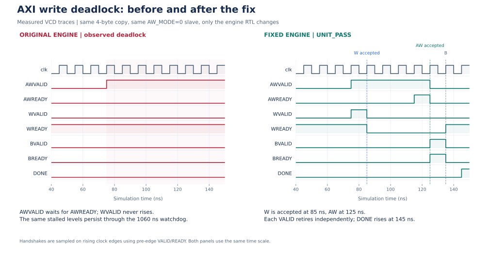

# AXI write deadlock and responder error regression

## Confirmed failure: WVALID depended on AWREADY

Baseline commit: `c5f730ddb48d09e6effee9ebe9ac23aac5003cc1`.

I reproduced a deadlock in the original DMA: it raised AWVALID after receiving read data, then waited for the
AW handshake before raising WVALID. A slave is allowed to wait for WVALID before
asserting AWREADY. With that legal dependency, neither side progressed.

Protocol reference: [Arm IHI0022H, section A3.3, page A3-46](https://developer.arm.com/-/media/Arm%20Developer%20Community/PDF/IHI0022H_amba_axi_protocol_spec.pdf).

`tb/unit/engine_aw_w_test.sv` supplies a small independent AXI slave. Mode 0 waits
until WVALID is observed before accepting AW, and accepts W before AW. On the
original RTL the same test timed out at 1060 ns:

```text
ENGINE_TIMEOUT mode=0 AWVALID=1 AWREADY=0 WVALID=0 WREADY=1
```

I changed the engine to publish AW and W together when a successful read is accepted. Each
VALID remains set until its own handshake. The engine enters the B-response
state once both handshakes have completed, including simultaneous handshakes.
The pending VALID flags preserve the payload under channel backpressure.

### Measured before/after trace



For this figure, I compiled the engine from `c5f730d` and the current engine against
the same current `dma_pkg.sv`, `axi_if.sv`, and `engine_aw_w_test.sv`, using
`+AW_MODE=0`. This isolates the engine change. The figure represents an engine-only
comparison; the rest of the historical checkout is outside this reproduction.

The baseline holds AWVALID high and WVALID low until the testbench watchdog fires
at **1060 ns**. In the fixed trace, I observe **W at 85 ns**, **AW at 125 ns**, and
**B at 135 ns**, followed by **DONE at 145 ns**. WDATA remains held while its
channel is pending, and AWVALID stays asserted after W completes until AW is
accepted. These are measured simulation events; the watchdog is a testbench bound,
not a hardware timeout or an AXI latency requirement.

I include the raw traces and rerun commands in the
[waveform guide](../waveforms/README.md). The
[source evidence](../results/waveform_evidence.json) identifies the compared inputs,
and the [event record](../results/waveform_events.json) records the measured times.

### Related unit outcomes

My focused unit suite on ModelSim Intel FPGA Edition 2020.1 recorded:

| Unit case | Observed result |
| --- | --- |
| `+AW_MODE=0` | PASS: W at cycle 8, AW at cycle 12 |
| `+AW_MODE=1` | PASS: AW at cycle 8, W at cycle 12 |
| `+AW_MODE=2` | PASS: AW and W at cycle 8 |
| `+RRESP=2` | PASS: error code 5 |
| `+BRESP=2` | PASS: error code 6 |
| `+BAD_RLAST=1` | PASS: error code 8 |

Error constants now reference `dma_pkg` instead of maintaining inconsistent
engine-local values. Codes 4 and 7 remain reserved. START while busy is ignored;
there is no hardware timeout.

## Confirmed failure: final WLAST error omitted from BRESP

The original memory responder scheduled `wr_err <= 1` for a missing final WLAST,
then used the old value of `wr_err` to choose BRESP on the same edge. The focused
memory test returns an error for a final beat with WLAST=0. Running it against
the original responder obtained:

```text
BRESP mismatch/instability addr=00000200 expected=10 got=00
```

I fixed the responder by computing a complete blocking `beat_err`, including byte-range and WLAST
checks, before scheduling the registered error state and BRESP.

`tb/unit/mem_model_test.sv` also checks byte strobes and destination guard bytes,
R/B payload stability while READY is held low, persistent address-based SLVERR
injection, and progress with bounded stalls. The adversarial test completed in
121 cycles with the controls below, and repeated with the same cycle count.
The default timing case completed in 55 cycles.

```text
+AXI_AW_WAIT_W=1 +AXI_STALL_MAX=7 +AXI_STALL_SEED=42
+AXI_BERR_ADDR=204 +AXI_RERR_ADDR=204
```

## Memory responder controls

| Plusarg | Meaning |
| --- | --- |
| `AXI_AW_WAIT_W=1` | AWREADY also requires WVALID; W acceptance starts after AW acceptance. |
| `AXI_STALL_MAX=N` | Additional per-channel delays in 0..N cycles; N must be 0..1024. Default 0. |
| `AXI_STALL_SEED=N` | Decimal seed of a local PRNG, independent of UVM randomization; default 1. |
| `AXI_RERR_ADDR=hex` | Every AR transaction starting at this address returns SLVERR. |
| `AXI_BERR_ADDR=hex` | Every AW transaction starting at this address returns SLVERR. |

AW/AR delays count while VALID is pending and the responder can accept a new
transaction. W delays count after AW acceptance and while WVALID is pending.
R/B responses have ordinary registered model latency plus the selected delay.
Once RVALID or BVALID is asserted, payload stays stable until handshake. A fixed
seed, stimulus, and reset schedule reproduce the same timing.

Injected read errors still return the memory data. Injected write errors still
apply the write strobes; software cannot assume an error means memory was not
modified. Injection matches the initial transaction address, not each byte or
beat address. The model can respond to bursts, but this project's supported DUT
and verification scope are aligned full-width single-beat AXI transfers.

## Reproduce

Run the repository unit runner from the repository root:

```powershell
.\scripts\run_unit_checks.ps1
```

It runs 14 isolated RTL/responder/checker cases, including register event
priority, and preserves transcripts plus JSON/JUnit under a fresh
`out/unit_<id>/`. The deliberately corrupted checker case requires
exactly one detected error and is reported as `PASS_EXPECTED_DETECTION`, separate
from ordinary clean DUT regression evidence. Select a subset with
`-Cases engine_w_before_aw,regs_event`; use `-VsimPath` and `-UvmPath` when the
simulator or UVM sources are not discoverable. Exit code 0 means all selected
cases met their expected outcomes; 1 indicates setup failure, 2 compilation
failure, and 3 a failed or timed-out unit.

The following lower-level commands are also available for interactive debug:

Create a separate ModelSim library, then compile:

```powershell
vlib out/rtl_unit/work
vlog -work out/rtl_unit/work -sv rtl/dma_pkg.sv tb/interfaces/axi_if.sv `
  tb/mem/mem_bkdr_if.sv rtl/dma_engine_axi.sv tb/mem/axi_mem_model.sv `
  tb/unit/engine_aw_w_test.sv tb/unit/mem_model_test.sv
vsim -c -lib out/rtl_unit/work engine_aw_w_test +AW_MODE=0 -do "run -all; quit -code 0"
vsim -c -lib out/rtl_unit/work mem_model_test +AXI_AW_WAIT_W=1 `
  +AXI_STALL_MAX=7 +AXI_STALL_SEED=42 +AXI_BERR_ADDR=204 +AXI_RERR_ADDR=204 `
  -do "run -all; quit -code 0"
```

Use an explicit `-modelsimini` file and absolute forward-slash library paths if
the simulator installation requires them. A passing unit run must contain
`UNIT_PASS` and no `** Fatal:` or `** Error:`. This simulator can return exit code
zero after `$fatal`, so process exit code alone is insufficient.

I preserve the original pre/post-fix evidence in my local archive. The [published evidence notes](../results/README.md) explain how I retain source hashes and sanitize review copies.
