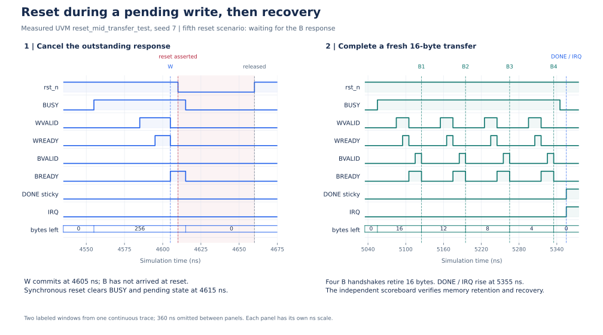

# Measured waveforms

I use these figures to explain two behaviors I reproduced in simulation: the original AXI write deadlock and recovery after a shared reset. I retain the original VCD bytes here so the plotted edges can be inspected independently of the images. Git attributes disable line-ending conversion for these traces and the published figures, preserving their recorded hashes across checkouts.

| Trace | Test and observed result |
| --- | --- |
| [Original engine](axi_write_before.vcd) | `engine_aw_w_test +AW_MODE=0`: expected `ENGINE_TIMEOUT` at 1060 ns; simulator exit 3. |
| [Fixed engine](axi_write_after.vcd) | The same test: `UNIT_PASS`, W handshake at 85 ns, AW at 125 ns, B at 135 ns, DONE at 145 ns; exit 0. |
| [Reset and recovery](reset_recovery.vcd) | UVM `reset_mid_transfer_test`, seed 7: PASS, zero UVM errors/fatals; five resets and five successful recovery transfers. |

The [capture record](../results/waveform_evidence.json) contains tool configuration, source fingerprints, outcomes, and VCD hashes. The [derived event record](../results/waveform_events.json) lists the times used in the figures.

## AXI write-channel comparison


I use the exact engine blob from commit `c5f730ddb48d09e6effee9ebe9ac23aac5003cc1` for the original case. Both runs use the same current package, interface, and standalone testbench; only the engine file differs. This isolates the engine change rather than replaying an entire historical checkout.

The slave waits for WVALID before accepting AW and deliberately accepts W first. The original engine holds AWVALID while waiting for AWREADY, but never asserts WVALID. The fixed engine asserts both independently and keeps each VALID high until its own handshake. The displayed 40–150 ns interval uses the same scale in both panels. The original VCD continues to the measured watchdog at 1060 ns.

The capture runner succeeds only when it obtains both expected outcomes. That does not turn the original DUT failure into a passing regression. Its bounded simulation and wall-clock limits also remain separate from the DUT's testbench watchdog.

From a Git clone with the baseline commit available and ModelSim/Questa on PATH:

```powershell
.\scripts\capture_axi_write_evidence.ps1
```

The command prints a fresh `out/wave_capture_<id>/` directory containing `before.vcd`, `after.vcd`, frozen source inputs, SHA-256 records, Tcl commands, and logs. `-VsimPath` selects an explicit simulator. The fixed-outcome gate checks this testbench's known W-before-AW result; a deliberate change to its timing requires reviewing that expectation. A source ZIP has no Git history, so this before/after capture command requires a Git clone. The published VCD files can be rendered from either distribution.

## Reset while waiting for a write response



I show the fifth reset scenario from one continuous UVM trace. W is accepted at 4605 ns, committing the first word in this responder. Reset is asserted at 4610 ns while BREADY is high and BVALID is low. Because reset is synchronous, BUSY, remaining bytes, and pending protocol state clear on the 4615 ns clock edge. Reset is released at 4660 ns.

A new 16-byte descriptor starts at 5055 ns. Four write responses retire it, and sticky DONE/IRQ rise at 5355 ns. The figure omits 360 ns between its two labeled windows; each panel has its own time scale. It does not imply that the two windows are adjacent.

The waveform shows handshakes and control state. My independent scoreboard verifies memory retention and the recovery copies: this run checked 655,360 bytes across ten whole-memory checks, with five reset aborts and five completed transfers. I do not infer retained memory contents from a control-only waveform.

```powershell
.\run_regression.ps1 -Tests reset_mid_transfer_test -Seeds 7 -Waves
```

`-Waves` is optional. It preserves signal visibility and records a small explicit set of DUT control and AXI signals in each case's `waves.vcd`; it does not dump memory or UVM objects. The report records `WavesEnabled` and `WavePath`. The same compilation and UVM result gates apply. The shown run uses default responder timing and `+AXI_STALL_SEED=7`.

## Render the figures again

The renderer requires Python 3 and Matplotlib. With those installed, this command regenerates SVG and PNG figures plus the event record from the checked-in VCD files:

```bash
python3 -B scripts/render_waveforms.py
```

For a newly captured comparison and reset run, replace the directory placeholders below with the paths printed by the runners:

```bash
python3 -B scripts/render_waveforms.py --before out/wave_capture_RUN/before.vcd --after out/wave_capture_RUN/after.vcd --reset output/uvm_RUN/reset_mid_transfer_test_seed_7/waves.vcd --output output/rendered_waves --events output/rendered_waves/events.json
```

These figure templates intentionally check for the demonstrated deadlock and four-word recovery pattern. They fail if the selected traces do not contain those events. They are not a general waveform viewer or an additional coverage-closure metric.

The parser preserves unknown values, handles ModelSim's split wire declarations, and counts handshakes from VALID/READY immediately before each rising clock edge. This matters when nonblocking updates deassert VALID at the same timestamp. Plots are cropped only within captured simulation time; no unobserved tail is extended.

```bash
python3 -B -m unittest discover -s scripts -p test_waveform_events.py
```

The [DUT block diagram](../images/dma_architecture.svg) is a separate schematic derived from the RTL. It explains connectivity; the two timing figures above come from simulation events.
